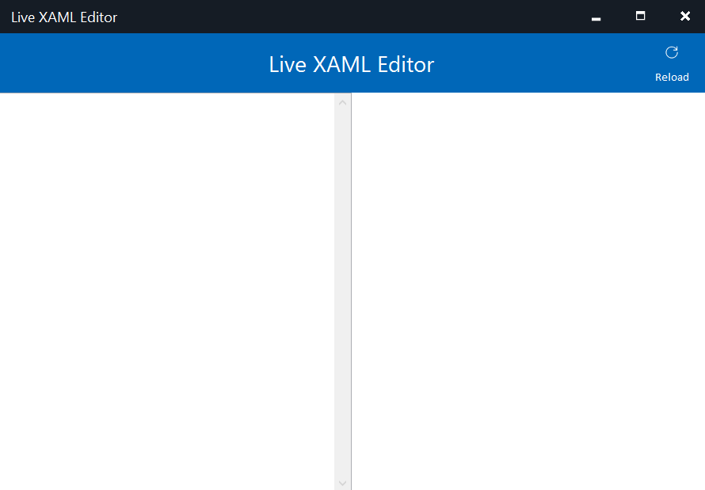

# FormsWPFLive

**Live XAML** development for Xamarin Forms Apps using **WPF** Backend.

***NOTE**: Work in progress!*

## Setup

Clone this repository. Open the solution in **FormsWPFLive.sln** with Visual Studio and press F5.

## Usage

To live develop XAML you open the **FormsWPFLive** tool. Any change detected in the left editor will be previewed in the right panel.

The tool can also detect XAML markup **errors**.

## Feedback 

Please use [GitHub issues](https://github.com/jsuarezruiz/FormsWPFLive/issues) for questions, comments, feature requests, or if would like to vote on what others are recommending.

## License

Code released under the [MIT license](https://opensource.org/licenses/MIT).
